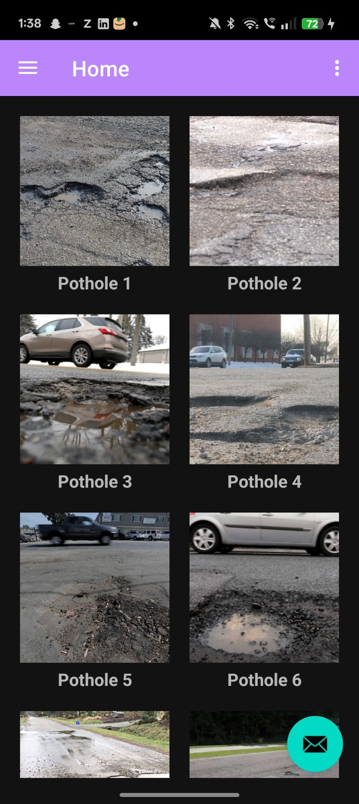
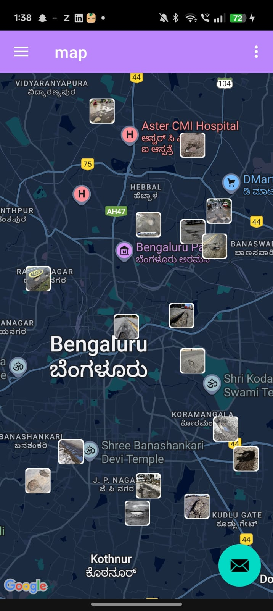
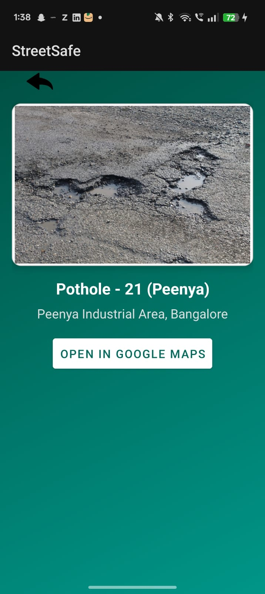
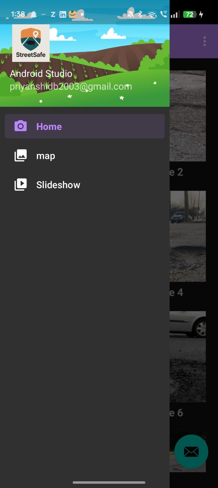
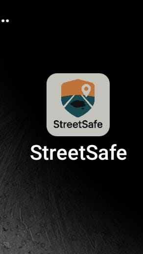

# Pothole Detection & Reporting Android App

An Android application that allows users to detect, report, and visualize potholes on a map using real-time data storage. The app helps improve road maintenance awareness by enabling easy pothole reporting with location tracking.

---

## 🚀 Features

- Capture and submit pothole reports from the mobile device  
- Store pothole data in real time using Firebase  
- Display reported potholes on an interactive Google Maps view  
- View pothole locations for better tracking and visualization  
- Simple and user-friendly Android UI  

---

## 🛠️ Tools & Technologies

- **Language:** Java  
- **Platform:** Android SDK  
- **UI:** XML  
- **Backend:** Firebase Realtime Database  
- **Maps:** Google Maps API  

---
 
## 🎬 App Flow Screens
 
 
<p align="center">
  
  
  
  
  
 
 
</p>
 
---
## 📱 App Workflow

1. User captures pothole information from the app  
2. Location data is fetched using device GPS  
3. Pothole details are uploaded to Firebase in real time  
4. All reported potholes are displayed on Google Maps  

---

## 🔧 Setup & Installation

1. Clone the repository:
   ```bash
   git clone https://github.com/your-username/pothole-detection.gitmapsDetailPage.jpeg
HomePage.jpeg
Logo.jpeg
MapPage.jpeg
NavigationPage.jpeg ye page add katna h
